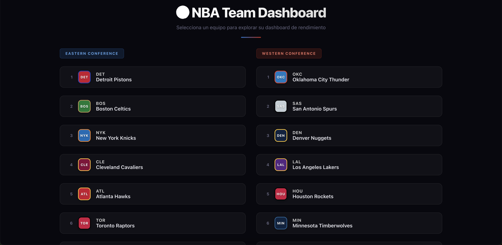
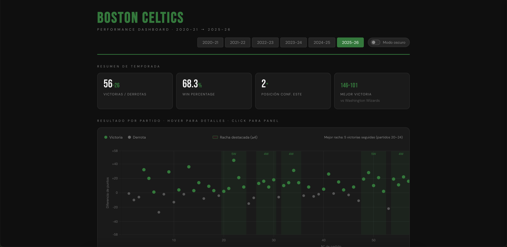
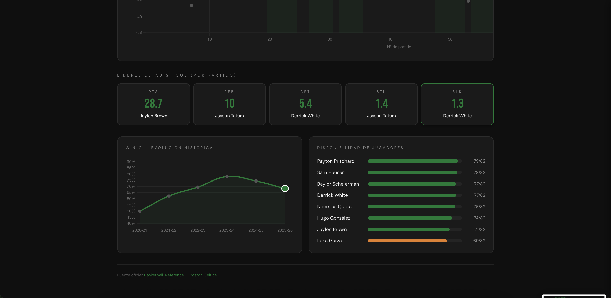

# NBA Team Dashboard

Dashboard interactivo de rendimiento NBA para los 30 equipos de la liga. Construido completamente sin backend — todo corre en el navegador con datos estáticos que se actualizan solos cada día vía GitHub Actions.

**Demo en vivo →** [czamoraz.github.io/nba-dashboard](https://czamoraz.github.io/nba-dashboard)

---

## Qué puedes ver

- **Resultados partido a partido** — gráfico de victorias y derrotas a lo largo de la temporada
- **Líderes estadísticos** — puntos, rebotes y asistencias por jugador
- **Win % histórico** — evolución del rendimiento del equipo por temporada desde 2021
- **Disponibilidad de jugadores** — seguimiento de lesiones y ausencias
- **Tema oscuro / claro** — toggle persistente en el navegador
- **30 equipos**, organizados por conferencia y división

---

## Referencia de abreviaturas NBA

| Conferencia Este | | Conferencia Oeste | |
|---|---|---|---|
| Atlanta Hawks | ATL | Dallas Mavericks | DAL |
| Boston Celtics | BOS | Denver Nuggets | DEN |
| Brooklyn Nets | BRK | Golden State Warriors | GSW |
| Charlotte Hornets | CHO | Houston Rockets | HOU |
| Chicago Bulls | CHI | Los Angeles Clippers | LAC |
| Cleveland Cavaliers | CLE | Los Angeles Lakers | LAL |
| Detroit Pistons | DET | Memphis Grizzlies | MEM |
| Indiana Pacers | IND | Minnesota Timberwolves | MIN |
| Miami Heat | MIA | New Orleans Pelicans | NOP |
| Milwaukee Bucks | MIL | Oklahoma City Thunder | OKC |
| New York Knicks | NYK | Phoenix Suns | PHO |
| Orlando Magic | ORL | Portland Trail Blazers | POR |
| Philadelphia 76ers | PHI | Sacramento Kings | SAC |
| Toronto Raptors | TOR | San Antonio Spurs | SAS |
| Washington Wizards | WAS | Utah Jazz | UTA |
